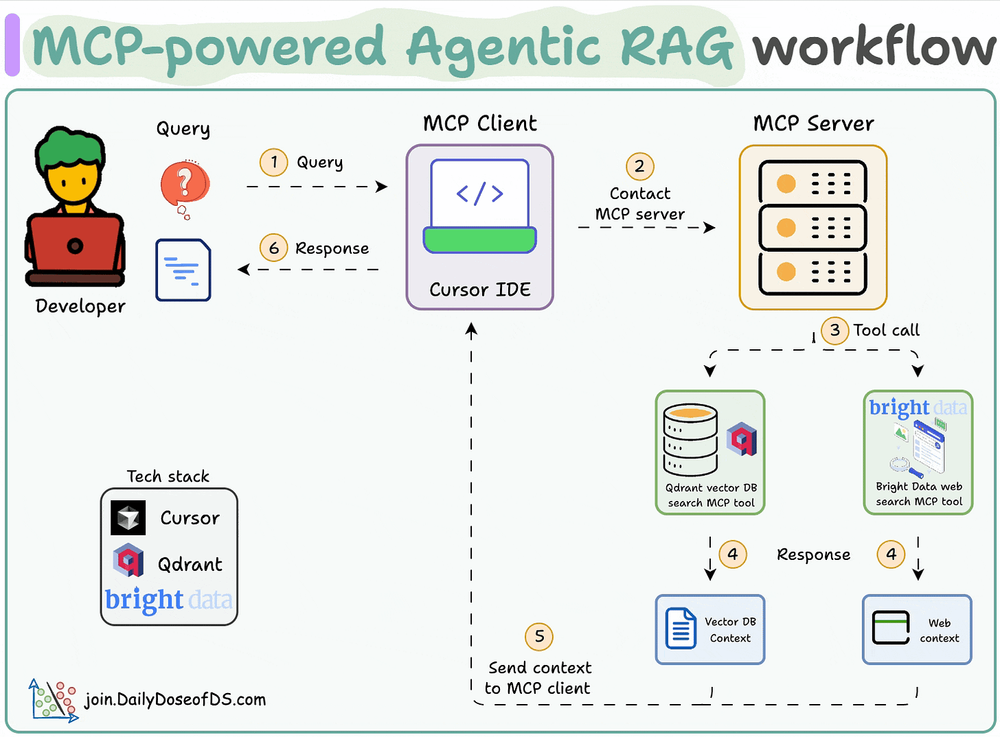

# 🤖 MCP-powered Agentic RAG using Bright Data and Qdrant

This project showcases a full-stack **Retrieval-Augmented Generation (RAG)** pipeline enhanced with **Model Context Protocols (MCPs)**. It uses intelligent agents that query both a local vector database and the open web to provide answers and enrich development workflows. Inspired by modern agent frameworks like AutoGPT and LangChain agents, but focused on **tool-augmented coding experiences** within environments like Cursor IDE.

---

## 🌐 Architecture Overview



### 🔄 How it works:
1. Developer writes a query in Cursor IDE
2. MCP Client sends it to MCP Server
3. Server uses tools (like Qdrant or Bright Data) to gather context
4. Responses are processed (vector DB and/or web content)
5. The context is returned to the client
6. Developer gets a tool-enhanced response for code generation or insight

---

## ⚙️ Tech Stack

- 🧠 **Cursor IDE**: Developer interface for coding with AI assistance
- 🗃️ **Qdrant**: Fast local vector database for contextual memory
- 🌐 **Bright Data**: Web data search with scraping capabilities
- 📜 **MCP Framework**: Defines and executes task-specific protocols with agent support

---

## 🧪 Setup and Installation

### 🔐 Bright Data API Key:
- Sign up at [Bright Data](https://brdta.com/dailydoseofds)
- Under “Proxies & Scraping,” create a SERP API (native proxy)
- Store credentials in a `.env` file:
```env
BRIGHDATA_USERNAME="your_username"
BRIGHDATA_PASSWORD="your_password"
```

### 📦 Install Dependencies
```bash
pip install mcp qdrant-client
```

---

## 🚀 Running the Project

### 1. Start Qdrant via Docker
```bash
docker run -p 6333:6333 -p 6334:6334 \
-v $(pwd)/qdrant_storage:/qdrant/storage:z \
qdrant/qdrant
```

### 2. Index some MCP data
Use `notebook.ipynb` to initialize your Qdrant collection and add MCPs.

### 3. Launch your local MCP server
In Cursor IDE settings → MCP → Add Global MCP Server:
```json
{
  "mcpServers": {
    "mcp-rag-app": {
      "command": "python",
      "args": ["/absolute/path/to/server.py"],
      "host": "127.0.0.1",
      "port": 8080,
      "timeout": 30000
    }
  }
}
```

✅ Done! Your IDE is now enhanced with Agentic RAG search capabilities.

